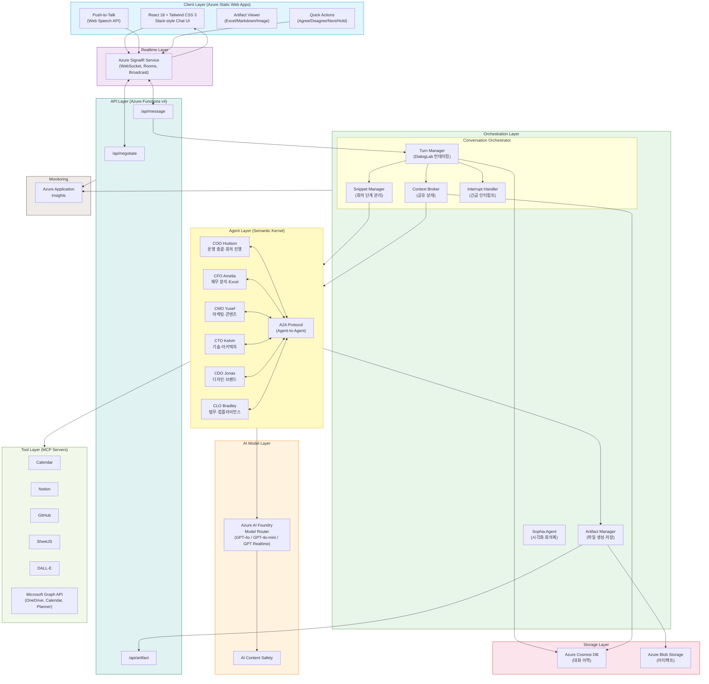
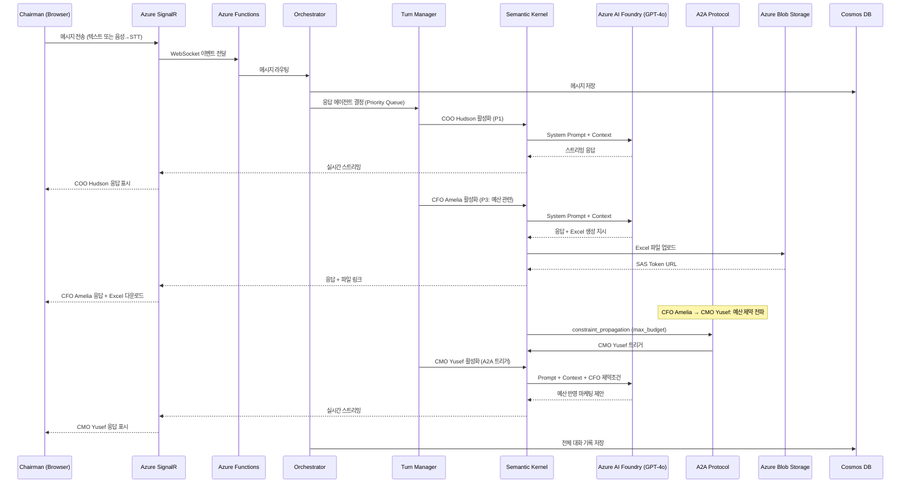
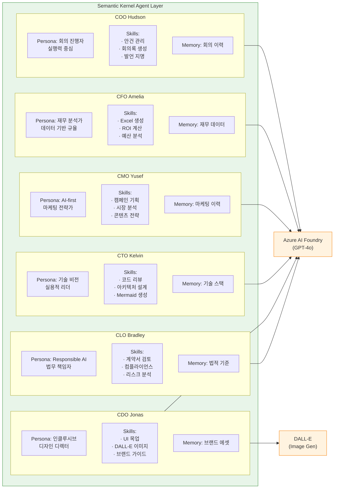
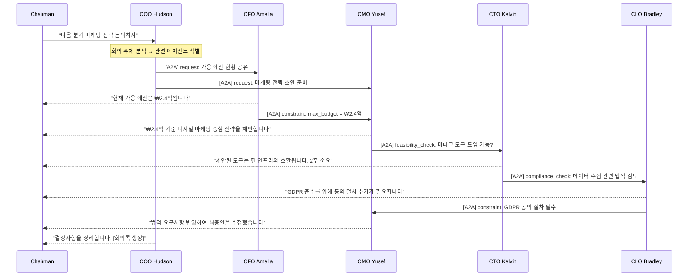

# BizRoom.ai — Architecture Document

> AI C-Suite 임원진과 실시간 회의하는 가상 사무실 웹 애플리케이션
> Microsoft AI Dev Days Hackathon 출품작

---

## 목차

1. [시스템 개요](#1-시스템-개요)
2. [아키텍처 다이어그램](#2-아키텍처-다이어그램)
3. [컴포넌트 상세](#3-컴포넌트-상세)
4. [데이터 플로우](#4-데이터-플로우)
5. [기술 선택 근거](#5-기술-선택-근거)
6. [Azure 서비스 통합 맵](#6-azure-서비스-통합-맵)
7. [보안 아키텍처](#7-보안-아키텍처)
8. [확장성 설계](#8-확장성-설계)
9. [배포 아키텍처](#9-배포-아키텍처)

---

## 1. 시스템 개요

### 1.1 비전

BizRoom.ai는 **AI C-Suite 임원진**(COO, CFO, CMO, CTO, CDO, CLO)과 사용자(Chairman)가 하나의 가상 회의실에서 실시간 대화하며 비즈니스 의사결정을 내리는 웹 애플리케이션이다. Google Research의 **DialogLab** 개념을 적용하여 에이전트 간 자연스러운 턴테이킹, 반박, 보완이 이루어지는 멀티에이전트 그룹 대화 환경을 구현한다.

Slack 스타일의 그룹 채팅 UI에서 **Push-to-Talk 음성 입력**(Web Speech API)과 텍스트 입력을 모두 지원하며, AI 에이전트들이 자신의 전문 분야에 따라 독립적으로 또는 협업하여 분석 결과, 전략 제안, 아티팩트(Excel, 회의록, 다이어그램 등)를 실시간으로 생성한다. 멀티유저를 지원하여 실제 팀원과 AI 에이전트가 동일한 회의에 동시 참여할 수 있다.

### 1.2 에이전트 구성

각 에이전트의 이름은 Microsoft 리더십 팀에서 영감을 받아 명명되었다.

| 에이전트 | 이름       | 영감 (Microsoft Leadership)      | 핵심 특성                                      |
| -------- | ---------- | -------------------------------- | ---------------------------------------------- |
| COO      | **Hudson** | Judson Althoff                   | 실행력 중심, 파트너십 기반 운영, 회의 진행 주도 |
| CFO      | **Amelia** | Amy Hood                         | 데이터 기반 재무 규율, 보수적 리스크 관리       |
| CMO      | **Yusef**  | Yusuf Mehdi                      | AI-first 마케팅, 소비자 전략, 트렌드 민감       |
| CTO      | **Kelvin** | Kevin Scott                      | 기술 비전, 아키텍처 설계, 실용적 트레이드오프   |
| CDO      | **Jonas**  | Jon Friedman                     | 인클루시브 디자인, 사용자 경험 중심, 접근성     |
| CLO      | **Bradley**| Brad Smith                       | Responsible AI, 규제 준수, 법적 리스크 경고     |

### 1.3 핵심 설계 원칙

| 원칙                     | 설명                                                                              |
| ------------------------ | --------------------------------------------------------------------------------- |
| Human-in-the-Loop        | 사람의 발언이 항상 우선 처리되며 최종 의사결정권은 Chairman에게 귀속               |
| 역할 기반 전문성         | 각 C-Suite 에이전트가 고유한 페르소나, 스킬, 판단 기준을 보유                      |
| 에이전트 간 자율 협업    | A2A 프로토콜로 에이전트끼리 반박/보완/위임/검증을 자율적으로 수행                   |
| 실체 있는 산출물         | 대화가 Excel, 회의록, 마케팅 플랜 등 실물 아티팩트로 즉시 변환                     |
| 실시간 협업              | SignalR 기반 WebSocket으로 멀티유저에게 즉시 메시지 전파                            |
| DialogLab 턴테이킹       | 사회적 역학(turn-taking, social dynamics)이 적용된 자연스러운 대화 구조             |

### 1.4 Hero 기술 활용

| Hero 기술                          | 활용 방식                                                                         | 필수 여부 |
| ---------------------------------- | --------------------------------------------------------------------------------- | --------- |
| Microsoft Foundry (Azure AI)       | GPT-4o 모델 호스팅, 프롬프트 관리, AI 안전성 가드레일 적용                         | 필수      |
| Microsoft Agent Framework (SK)     | 각 C-Suite 에이전트의 페르소나/스킬/메모리 구성 및 오케스트레이션                   | 필수      |
| Azure MCP                          | 외부 도구(캘린더, 드라이브, GitHub 등) 연동을 위한 표준 프로토콜                    | 필수      |
| Azure AI Foundry Model Router      | 에이전트 역할별 최적 모델 자동 라우팅 (GPT-4o, GPT-4o-mini, GPT Realtime)          | 필수      |
| GitHub Copilot Agent Mode          | 개발 전 과정에서 코드 생성, 리팩터링, 테스트 작성에 활용                            | 필수      |

---

## 2. 아키텍처 다이어그램

### 2.1 전체 시스템 아키텍처 (ASCII)

```
┌─────────────────────────────────────────────────────────────────────────────────────────┐
│                                    CLIENT LAYER                                         │
│                                                                                         │
│  ┌─────────────────────────────────────────────────────────────────────────────────┐     │
│  │                         React 18 + Tailwind CSS 3 (SPA)                         │     │
│  │                                                                                 │     │
│  │  ┌──────────────┐  ┌──────────────┐  ┌──────────────┐  ┌──────────────────┐    │     │
│  │  │  Chat Panel   │  │  Agent Cards │  │  Artifact    │  │  Push-to-Talk    │    │     │
│  │  │  (Slack-style)│  │  (Avatars)   │  │  Viewer      │  │  (Web Speech)    │    │     │
│  │  └──────┬───────┘  └──────┬───────┘  └──────┬───────┘  └────────┬─────────┘    │     │
│  │         │                 │                 │                    │               │     │
│  │         └─────────────────┴─────────────────┴────────────────────┘               │     │
│  │                                     │                                            │     │
│  └─────────────────────────────────────┼────────────────────────────────────────────┘     │
│                                        │ WebSocket                                       │
│          Azure Static Web Apps         │ (SignalR Client SDK)                             │
└────────────────────────────────────────┼─────────────────────────────────────────────────┘
                                         │
                    ╔════════════════════╧════════════════════╗
                    ║        Azure SignalR Service            ║
                    ║     (Realtime Message Broker)           ║
                    ║                                         ║
                    ║  · Room Management (meeting-room-*)     ║
                    ║  · Broadcast / Group Messaging          ║
                    ║  · Connection Authentication            ║
                    ║  · Human Priority Queue                 ║
                    ╚════════════════════╤════════════════════╝
                                         │
┌────────────────────────────────────────┼─────────────────────────────────────────────────┐
│                       API LAYER (Azure Functions v4 · Node.js 20 · TypeScript)           │
│                                        │                                                 │
│  ┌──────────────────┐  ┌──────────────┴──────────────┐  ┌──────────────────────────┐    │
│  │  /api/negotiate   │  │  /api/message               │  │  /api/artifact           │    │
│  │  (SignalR 인증)   │  │  (메시지 수신·라우팅)       │  │  (파일 생성·다운로드)    │    │
│  └──────────────────┘  └──────────────┬──────────────┘  └──────────────────────────┘    │
│                                        │                                                 │
└────────────────────────────────────────┼─────────────────────────────────────────────────┘
                                         │
┌────────────────────────────────────────┼─────────────────────────────────────────────────┐
│                              ORCHESTRATION LAYER                                         │
│                                        │                                                 │
│  ┌─────────────────────────────────────┼─────────────────────────────────────────────┐   │
│  │                    Conversation Orchestrator                                       │   │
│  │                                                                                   │   │
│  │  ┌────────────────┐  ┌────────────────┐  ┌────────────────┐  ┌────────────────┐  │   │
│  │  │  Turn Manager  │  │ Snippet Manager│  │ Context Broker │  │ Interrupt      │  │   │
│  │  │  (DialogLab    │  │ (회의 단계:    │  │ (공유 컨텍스트:│  │ Handler        │  │   │
│  │  │   턴테이킹)    │  │  Open→Discuss  │  │  Agenda,       │  │ (긴급 법적/    │  │   │
│  │  │               │  │  →Decide→Act)  │  │  Decisions,    │  │  재무/기술     │  │   │
│  │  │  Priority:     │  │               │  │  Facts,        │  │  리스크 감지)  │  │   │
│  │  │  P0 Human      │  │               │  │  Prefs)        │  │               │  │   │
│  │  │  P1 COO        │  │               │  │               │  │               │  │   │
│  │  │  P2 Mentioned  │  │               │  │               │  │               │  │   │
│  │  │  P3 Relevant   │  │               │  │               │  │               │  │   │
│  │  │  P4 Others     │  │               │  │               │  │               │  │   │
│  │  └────────┬───────┘  └────────┬───────┘  └────────┬───────┘  └────────┬───────┘  │   │
│  │           │                   │                   │                   │            │   │
│  │           └───────────────────┴───────────────────┴───────────────────┘            │   │
│  │                                       │                                            │   │
│  │                  ┌────────────────────┴────────────────────┐                       │   │
│  │                  │                                         │                       │   │
│  │        ┌─────────▼────────┐                  ┌────────────▼─────────┐              │   │
│  │        │ Artifact Manager  │                  │   Sophia Agent      │              │   │
│  │        │ (파일 생성·저장) │                  │ (시각·회의록 담당) │              │   │
│  │        │  · Excel 생성    │                  │  · Visual Gen       │              │   │
│  │        │  · Markdown      │                  │  · Meeting Minutes  │              │   │
│  │        │  · 이미지        │                  │  · BigScreen 렌더링 │              │   │
│  │        └─────────┬────────┘                  └────────────┬─────────┘              │   │
│  │                  │                                         │                       │   │
│  │                  └────────────────────┬────────────────────┘                       │   │
│  │                                       │                                            │   │
│  └───────────────────────────────────────┼───────────────────────────────────────────┘   │
│                                          │                                               │
└──────────────────────────────────────────┼───────────────────────────────────────────────┘
                                           │
┌──────────────────────────────────────────┼───────────────────────────────────────────────┐
│                      AGENT LAYER (Semantic Kernel for JavaScript)                        │
│                                          │                                               │
│  ┌─────────┐ ┌─────────┐ ┌─────────┐ ┌─────────┐ ┌─────────┐ ┌─────────┐              │
│  │   COO   │ │   CFO   │ │   CMO   │ │   CTO   │ │   CDO   │ │   CLO   │              │
│  │"Hudson" │ │"Amelia" │ │ "Yusef" │ │"Kelvin" │ │ "Jonas" │ │"Bradley"│              │
│  │ 운영총괄│ │ 재무분석│ │ 마케팅  │ │ 기술    │ │ 디자인  │ │ 법무    │              │
│  │ 회의관리│ │ Excel   │ │ 콘텐츠  │ │ 코드리뷰│ │ UI목업  │ │ 계약서  │              │
│  │ 회의록  │ │ 재무표  │ │ 전략    │ │ 아키텍처│ │ 브랜드  │ │ 컴플라이│              │
│  └────┬────┘ └────┬────┘ └────┬────┘ └────┬────┘ └────┬────┘ └────┬────┘              │
│       │           │           │           │           │           │                      │
│       └───────────┴───────────┴─────┬─────┴───────────┴───────────┘                      │
│                                     │                                                    │
│                          ┌──────────┴──────────┐                                         │
│                          │   A2A Protocol      │                                         │
│                          │ (Agent-to-Agent     │                                         │
│                          │  Communication)     │                                         │
│                          └──────────┬──────────┘                                         │
│                                     │                                                    │
│  Each Agent has: System Prompt (Persona) + Skills/Plugins + Memory (Buffer + Semantic)   │
│                                     │                                                    │
└─────────────────────────────────────┼────────────────────────────────────────────────────┘
                                      │
          ┌───────────────────────────┼───────────────────────────────┐
          │                           │                               │
╔═════════╧═════════╗  ╔═════════════╧═══════════════╗  ╔═══════════╧═══════════════╗
║  AI MODEL LAYER   ║  ║     TOOL LAYER              ║  ║   STORAGE LAYER           ║
║                   ║  ║                              ║  ║                           ║
║  Azure AI Foundry ║  ║  MCP Servers                ║  ║  Azure Cosmos DB          ║
║  (Azure OpenAI)   ║  ║  (External Tools)           ║  ║  · Conversation history   ║
║                   ║  ║                              ║  ║  · Agent states           ║
║  · Model Router   ║  ║  · Calendar (Google/MS365)  ║  ║  · Decision log           ║
║  · GPT-4o         ║  ║  · Notion / OneNote         ║  ║                           ║
║  · GPT-4o-mini    ║  ║  · GitHub (code ops)        ║  ║  Azure Blob Storage       ║
║  · GPT Realtime   ║  ║  · SheetJS (Excel gen)      ║  ║  · Artifacts (xlsx, md)   ║
║  · DALL-E 3       ║  ║  · DALL-E (image gen)       ║  ║  · Meeting notes          ║
║  · AI Safety      ║  ║  · Microsoft Graph API      ║  ║  · Generated images       ║
║  · Content Filter ║  ║  · OneDrive (file embed)    ║  ║                           ║
║                   ║  ║                              ║  ║                           ║
╚═══════════════════╝  ╚══════════════════════════════╝  ╚═════════════════════════════╝
```

### 2.2 에이전트 상호작용 다이어그램 (ASCII)

```
                    ┌─────────────────────────────────────┐
                    │        Chairman (사용자)              │
                    │   "다음 분기 마케팅 예산을 논의하자"  │
                    └───────────────────┬─────────────────┘
                                        │
                                        ▼
                    ┌─────────────────────────────────────┐
                    │       COO Hudson (회의 진행)         │
                    │  "네, 마케팅 예산 논의 시작합니다.    │
                    │   Amelia님, 현재 재무 현황 공유해주세요" │
                    └───────────────────┬─────────────────┘
                                        │ A2A
                          ┌─────────────┴──────────────┐
                          ▼                            ▼
          ┌───────────────────────┐   ┌───────────────────────┐
          │  CFO Amelia (재무분석)│   │   CMO Yusef (마케팅)   │
          │ "현재 가용 예산은     │   │ "지난 분기 ROI 기반    │
          │  ₩2.4억, 전분기 대비 │   │  디지털 채널 강화를    │
          │  +12%"               │   │  제안합니다"           │
          │ [Excel 생성]         │   │                        │
          └───────────┬──────────┘   └───────────┬───────────┘
                      │ A2A: budget_constraint    │
                      └──────────────┬────────────┘
                                     ▼
                    ┌─────────────────────────────────────┐
                    │     CMO Yusef (예산 반영 수정)       │
                    │  "Amelia의 가용 예산 ₩2.4억 기준으로  │
                    │   최적 채널 배분안을 수정했습니다"    │
                    └───────────────────┬─────────────────┘
                                        │ A2A: feasibility_check
                                        ▼
                    ┌─────────────────────────────────────┐
                    │       CTO Kelvin (기술 타당성)       │
                    │  "제안된 마테크 도구 도입은 기존      │
                    │   인프라와 호환됩니다. 2주 소요"      │
                    └───────────────────┬─────────────────┘
                                        │ A2A: compliance_check
                                        ▼
                    ┌─────────────────────────────────────┐
                    │       CLO Bradley (법적 검토)        │
                    │  "GDPR 준수를 위해 사용자 동의       │
                    │   절차 추가가 필요합니다"             │
                    └───────────────────┬─────────────────┘
                                        │
                                        ▼
                    ┌─────────────────────────────────────┐
                    │       COO Hudson (결론 정리)         │
                    │  "결정사항을 정리합니다.              │
                    │   회의록 생성을 Sophia에 요청합니다"   │
                    └───────────────────┬─────────────────┘
                                        │
                                        ▼
                    ┌─────────────────────────────────────┐
                    │    Sophia Agent (회의록 생성)       │
                    │  "회의 전체 내용을 분석합니다.      │
                    │   마크다운 회의록을 생성했습니다"   │
                    │   [meeting-minutes.md]"             │
                    └─────────────────────────────────────┘
```

### 2.3 시스템 아키텍처 (Mermaid)



### 2.4 데이터 플로우 시퀀스 (Mermaid)



### 2.5 에이전트 구성 다이어그램 (Mermaid)



---

## 3. 컴포넌트 상세

### 3.1 Client Layer (프론트엔드)

#### 기술 구성

| 항목                   | 기술                          | 역할                                                             |
| ---------------------- | ----------------------------- | ---------------------------------------------------------------- |
| UI 프레임워크          | React 18+                     | 컴포넌트 기반 SPA, 실시간 상태 관리                              |
| 스타일링               | Tailwind CSS 3                | 유틸리티 퍼스트 CSS, Slack 스타일 레이아웃 구현                   |
| 3D 렌더링              | React Three Fiber + drei      | 3D 가상 회의실, 에이전트 아바타, 홀로그래픽 모니터                |
| 3D 아바타              | Ready Player Me GLB           | 에이전트별 3D 캐릭터 모델, 좌석 포즈, 시선 추적                  |
| 실시간 통신            | @microsoft/signalr            | WebSocket 기반 양방향 실시간 메시지 송수신                        |
| 음성 입력              | Web Speech API                | 브라우저 네이티브 STT, Push-to-Talk 방식, 무료                   |
| 상태 관리              | React Context + useReducer    | 채팅 메시지, 에이전트 상태, 회의 상태 관리 (Zustand 마이그레이션 옵션) |
| 호스팅                 | Azure Static Web Apps         | 글로벌 CDN, 자동 HTTPS, GitHub 연동 CI/CD                        |

#### UI 레이아웃

```
┌─────────────────────────────────────────────────────────────┐
│  BizRoom.ai                              🔍  ⚙️  👤       │
├──────────────┬──────────────────────────────────────────────┤
│              │                                              │
│  CHANNELS    │  #strategy-meeting                  📌  ⋮   │
│              │ ─────────────────────────────────────────── │
│  #strategy-  │                                              │
│   meeting    │  COO Hudson                     10:01 AM    │
│  #marketing  │  안녕하세요, 전략 회의를 시작하겠습니다.     │
│  #finance    │  이번 주 주요 안건은 3가지입니다.            │
│  #tech       │                                              │
│              │  👤 Chairman                     10:02 AM    │
│  DIRECT MSG  │  마케팅 예산부터 논의합시다.                 │
│              │                                              │
│  COO Hudson  │  CFO Amelia                      10:02 AM    │
│  CFO Amelia  │  현재 가용 예산 현황을 공유드립니다.         │
│  CMO Yusef   │  📊 Q1_Budget_Analysis.xlsx  [다운로드]      │
│  CTO Kelvin  │                                              │
│  CDO Jonas   │  CMO Yusef  ···  (입력 중)                   │
│  CLO Bradley │                                              │
│              │                                              │
│              ├──────────────────────────────────────────────┤
│              │  [👍 동의] [👎 반대] [⏭️ 다음] [🛑 보류]    │
│              │                                              │
│              │  [🎙️ Push-to-Talk]  💬 메시지를 입력하세요…  │
│              │                                       [전송] │
└──────────────┴──────────────────────────────────────────────┘
```

#### 주요 컴포넌트

| 컴포넌트           | 파일명                 | 역할                                                          |
| ------------------ | ---------------------- | ------------------------------------------------------------- |
| ChatPanel          | `ChatPanel.tsx`        | 메인 채팅 패널, 메시지 타임라인, 스크롤, 스트리밍 표시         |
| AgentCard          | `AgentCard.tsx`        | 에이전트 프로필 이미지, 이름, 상태 ("입력 중..." 인디케이터)   |
| ArtifactViewer     | `ArtifactViewer.tsx`   | Excel/Markdown/이미지 인라인 프리뷰 및 다운로드                |
| PushToTalk         | `PushToTalk.tsx`       | Space 키 홀드 → Web Speech API 활성화 → STT → 전송            |
| ChannelList        | `ChannelList.tsx`      | 채널/DM 목록, 활성 채널 표시, 안 읽은 메시지 뱃지              |
| QuickActions       | `QuickActions.tsx`     | 동의/반대/다음/보류 원클릭 의사 표시 버튼                      |
| MessageInput       | `MessageInput.tsx`     | 텍스트 입력창, @멘션 자동완성, 파일 첨부                       |

#### 3D 가상 회의실 (Immersive Meeting Room)

BizRoom.ai의 핵심 시각 요소. React Three Fiber 기반 3D 회의실에서 AI 에이전트들과 실시간 대화한다.

##### 회의실 레이아웃 (Top View)

```
                     Back Wall (Z=-7)
                 ┌─────────────────────┐
                 │    [BizRoom Logo]    │
                 │  [Artifact Screen]   │
                 │                      │
       Glass     │  CLO    COO    CMO   │     Glass
       Wall      │  Bradley Hudson Yusef│     Wall
       (X=-7)    │         [Chairman]   │     (X=+7)
                 │  CFO           CTO   │
                 │  Amelia       Kelvin │
                 │                      │
                 │  CLO           CDO   │
                 │  Bradley       Jonas │
                 │                      │
                 │    [Human 1] [Human 2]│
                 │     (Optional Seats)  │
                 └─────────────────────┘
                     Glass Wall (Z=+7)
                     Camera Default ↑
```

##### 3D 컴포넌트 구조

| 컴포넌트               | 파일명                  | 역할                                                          |
| ---------------------- | ----------------------- | ------------------------------------------------------------- |
| MeetingRoom3D          | `MeetingRoom3D.tsx`     | 3D 씬 오케스트레이터 — 좌석 배치, 키보드 제어, 카메라 관리    |
| RoomEnvironment3D      | `RoomEnvironment3D.tsx` | 고층 사무실 환경 — 유리벽, 하늘, 조명, 가구                   |
| MeetingTable3D         | `MeetingTable3D.tsx`    | 중앙 원형 테이블 + 센터 스크린                                |
| RPMAgentAvatar         | `RPMAgentAvatar.tsx`    | Ready Player Me GLB 아바타 — 좌석 포즈, 시선 추적, 발화 표시  |
| HoloMonitor3D          | `HoloMonitor3D.tsx`     | 홀로그래픽 모니터 — 에이전트/인간 앞 부유형 디스플레이         |
| ArtifactScreen3D       | `ArtifactScreen3D.tsx`  | 뒷벽 대형 프레젠테이션 스크린 (3.4×1.9)                       |
| CameraController       | `CameraController.tsx`  | 멀티 모드 카메라 — 조감도, 1인칭, 백모니터 시점                |
| ChatOverlay            | `ChatOverlay.tsx`       | 3D 위에 오버레이되는 채팅 UI                                   |

##### 카메라 시스템 (멀티 모드)

| 모드                   | 활성화                  | 카메라 위치                    | 설명                                                 |
| ---------------------- | ----------------------- | ------------------------------ | ---------------------------------------------------- |
| Overview (기본)        | 앱 시작 시              | `(0, 5.0, -4.5)`              | Chairman 뒤에서 전체 회의 조감. OrbitControls 활성    |
| First-person           | `V` 키 토글             | `(0, 1.18, -1.3)`             | Chairman 눈 높이 1인칭 뷰. 몰입감 극대화             |
| First-person + Yaw     | `A`/`D` 키 (1인칭 중)  | 동일, 시선 ±50° 회전          | 좌/우 에이전트를 향해 고개 돌리기                     |
| Back Monitor           | `` ` `` 키 토글         | `(0, 2.2, -3.0)`              | 뒷벽 아티팩트 스크린을 정면으로 바라보기              |

카메라 전환은 `exponential lerp damping` 으로 부드럽게 이루어진다: `1 - Math.pow(0.02, delta)`

##### 홀로그래픽 모니터

각 에이전트/인간 참여자 앞에 부유하는 미래형 디스플레이:
- **크기**: 0.52w × 0.34h (테이블 위 약간 떠 있음)
- **구성**: 다크 글라스 패널 + 에이전트 컬러 테두리 + 코너 브래킷 + 스캔라인
- **프로젝션 빔**: 테이블 표면에서 모니터까지 홀로그램 빔 연출
- **표시 정보**: 역할명 (대문자), 에이전트 이름, 상태
- **Chairman 모니터**: 1인칭 시점을 가리지 않도록 렌더링에서 제외

##### 멀티 인간 참여자 (최대 3명)

| 좌석                   | 위치                    | 역할                                     |
| ---------------------- | ----------------------- | ---------------------------------------- |
| Chairman (필수)        | `(0, 0, -2.2)`         | 방 생성자. 의장 역할. 1인칭 뷰 제공      |
| Human 1 (선택)         | `(-0.9, 0, 2.1)`       | Chairman 맞은편 좌측. 초대 링크로 입장    |
| Human 2 (선택)         | `(0.9, 0, 2.1)`        | Chairman 맞은편 우측. 초대 링크로 입장    |

각 인간 참여자는: 사무용 의자 + 홀로그래픽 모니터 + Billboard 이름 배지를 받는다.

##### 환경 조명 (Golden Hour Office)

| 조명                   | 설정                    | 역할                                     |
| ---------------------- | ----------------------- | ---------------------------------------- |
| Ambient                | intensity 1.6           | 전체적 밝기 보장                         |
| Sunlight (golden hour) | intensity 2.5, `#ffe0aa`| 우측에서 비치는 따뜻한 햇빛              |
| Fill light             | intensity 0.8, `#cce0ff`| 좌측 쿨톤 보조광                         |
| Track lights           | emissive 3.5            | 천장 레일 조명, 실내 디테일              |

#### 주요 React Hooks

| Hook               | 파일명              | 역할                                                           |
| ------------------ | -------------------- | -------------------------------------------------------------- |
| `useSignalR`       | `useSignalR.ts`      | SignalR 연결 관리, 재연결 로직, 메시지 구독                    |
| `useSpeech`        | `useSpeech.ts`       | Web Speech API 래핑, 음성 인식 상태 관리, 텍스트 프리뷰        |
| `useAgent`         | `useAgent.ts`        | 에이전트 상태 관리 (응답 중, 대기, 에러)                       |
| `useMeeting`       | `useMeeting.ts`      | 회의 상태 (진행 중, 단계, 참가자)                              |

### 3.2 Azure SignalR Service (실시간 레이어)

#### 아키텍처

```
┌──────────────────────────────────────────────────────────────┐
│                   Azure SignalR Service                       │
│                   (Serverless Mode)                           │
│                                                              │
│  ┌──────────────────┐    ┌──────────────────┐               │
│  │  Hub: "bizroom"  │    │  Hub: "notify"   │               │
│  │                  │    │                  │               │
│  │  Groups:         │    │  · Agent status  │               │
│  │  · meeting-0311  │    │  · Typing events │               │
│  │  · marketing-ch  │    │  · System alerts │               │
│  │  · finance-ch    │    │  · User join/leave│               │
│  └──────────────────┘    └──────────────────┘               │
│                                                              │
│  Connection Flow:                                            │
│  Client → /api/negotiate → Token 발급 → WebSocket 연결      │
└──────────────────────────────────────────────────────────────┘
```

#### 기능 상세

| 기능                     | 설명                                                                      |
| ------------------------ | ------------------------------------------------------------------------- |
| Room Management          | 회의별 방 생성 (`meeting-0311`), 참가자 자동 그룹 할당                     |
| Broadcast                | 에이전트 메시지를 해당 방의 모든 사용자에게 동시 전파                      |
| Speaker Identification   | 인증 세션 기반 발언자 자동 식별 (누가 어떤 메시지를 보냈는지 추적)         |
| Human Priority Queue     | 사람의 메시지가 에이전트 메시지보다 항상 우선 처리                         |
| Streaming Support        | WebSocket 스트리밍으로 에이전트 응답을 글자 단위 실시간 전달               |
| Auto-Reconnect           | 연결 끊김 시 지수 백오프(exponential backoff) 기반 자동 재연결             |

### 3.3 Orchestration Layer (오케스트레이션)

백엔드의 핵심 로직을 담당하는 Conversation Orchestrator는 4개의 하위 모듈과 Artifact Manager로 구성된다.

#### 3.3.1 Turn Manager (DialogLab 기반 발언 순서 관리)

```
┌─────────────────────────────────────────────────┐
│                Turn Manager                      │
│                                                  │
│  Priority Queue:                                 │
│  ┌─────────────────────────────────────────┐    │
│  │  P0: Human messages (항상 최우선)       │    │
│  │  P1: COO Hudson (회의 진행 역할)        │    │
│  │  P2: Directly mentioned agent (@Amelia) │    │
│  │  P3: Contextually relevant agent        │    │
│  │  P4: Other agents (관련성 낮은 순)      │    │
│  └─────────────────────────────────────────┘    │
│                                                  │
│  DialogLab Rules:                                │
│  · 동시에 최대 2명의 에이전트만 응답             │
│  · 에이전트 응답 간 최소 1.5초 간격              │
│  · Human 메시지 수신 시 에이전트 큐 일시 정지    │
│  · COO Hudson이 지명한 에이전트가 P2로 승격      │
│  · 자율 토론 시 최대 5턴까지 허용                │
│  · 5턴 초과 시 COO Hudson이 자동 요약·중재       │
└─────────────────────────────────────────────────┘
```

DialogLab 논문에서 영감을 받은 발언 순서 관리 시스템으로, 자연스러운 회의 흐름을 재현한다. 핵심 원칙:

- **Human Priority**: 사용자가 발언하면 에이전트 큐가 즉시 중단된다
- **Contextual Relevance**: 사용자의 발언 내용과 관련된 에이전트만 응답한다 (키워드 + 의미 분석)
- **Anti-Flooding**: 에이전트가 연속으로 메시지를 쏟아내는 것을 방지한다
- **Natural Pacing**: 에이전트 간 응답에 자연스러운 간격을 두어 실제 회의처럼 보이게 한다

#### 3.3.2 Snippet Manager (회의 단계 관리)

```
Phase 0           Phase 1          Phase 2          Phase 3          Phase 4          Phase 5          Phase 6
PRE-MEETING ──▶  OPENING    ──▶  BRIEFING   ──▶  DISCUSSION ──▶  DECISION   ──▶  ACTION     ──▶  CLOSING
(사전 조사)       (개회)           (브리핑)         (토론)           (의사결정)       (실행 항목)       (폐회)
                                                                                                      │
  · COO Hudson     · 안건 공유      · 각 에이전트     · 의견 제시      · 투표/합의      · Task 할당      · 회의록 생성
  · Bing Search    · 참석자 확인      현황 보고       · A2A 교차 검증  · 최종 확인      · 아티팩트 생성   · 다음 회의 일정
                   · 목표 설정
```

회의의 자연스러운 진행을 위해 Phase 0 ~ Phase 6의 7단계 페이즈를 관리한다. Phase 0에서 COO Hudson이 Bing Search를 활용한 사전 조사를 수행하고, 이후 각 단계에서 회의 진행을 주도하며, Snippet Manager는 현재 단계를 트래킹하고 적절한 시점에 다음 단계로의 전환을 유도한다.

#### 3.3.3 Context Broker (공유 컨텍스트)

모든 에이전트가 접근하는 공유 상태 저장소로, 다음 정보를 관리한다:

| 컨텍스트 항목          | 설명                                                     | 예시                                              |
| ---------------------- | -------------------------------------------------------- | ------------------------------------------------- |
| Meeting Agenda         | 현재 회의의 안건 목록                                    | `["마케팅 예산", "신규 채용", "Q2 목표"]`          |
| Decision Log           | 회의 중 결정된 사항                                      | `{"마케팅 예산": "₩2.4억 확정"}`                  |
| Agent Memory           | 각 에이전트가 이전 대화에서 기억해야 할 정보             | Amelia: "지난주 예산 10% 삭감 논의"                |
| Shared Facts           | 모든 에이전트가 인지해야 할 공통 사실                    | "현재 분기 매출: ₩15억"                           |
| User Preferences       | 사용자의 선호도 및 스타일                                | "간결한 답변 선호, 표 형식 선호"                   |
| A2A Message Log        | 에이전트 간 주고받은 제약조건/검증 결과                   | `CFO→CMO: max_budget=₩2.4억`                     |

#### 3.3.4 Interrupt Handler (긴급 인터럽트)

특정 조건에서 에이전트가 현재 대화 흐름을 중단하고 즉시 발언하는 메커니즘:

| 에이전트   | 인터럽트 조건                          | 예시 발화                                                 |
| ---------- | -------------------------------------- | --------------------------------------------------------- |
| CLO Bradley | 법적 리스크 감지                      | "이 계약 조건은 법적으로 문제가 있습니다"                  |
| CFO Amelia  | 예산 한도 초과                        | "해당 제안은 가용 예산을 32% 초과합니다"                   |
| CTO Kelvin  | 기술적 불가능 사항 발견               | "현재 인프라에서는 구현이 불가능합니다"                     |

#### 3.3.5 Artifact Manager (아티팩트 관리)

에이전트가 생성한 파일을 관리한다.

| 기능              | 설명                                                                  |
| ----------------- | --------------------------------------------------------------------- |
| 파일 생성         | SheetJS(xlsx), Markdown, DALL-E(png) 등 포맷별 생성                   |
| Blob 업로드       | Azure Blob Storage에 업로드, SAS Token URL 생성 (24시간 유효)         |
| 인라인 프리뷰     | 채팅 내 카드 형태로 파일 미리보기 삽입                                |
| 버전 관리         | 동일 아티팩트의 수정 이력 추적 (v1, v2...)                            |
| 비동기 처리       | 채팅 응답을 먼저 전달하고 파일 생성은 백그라운드 수행                  |

#### 3.3.6 Sophia Agent (데이터 시각화 & 회의록 관리)

BizRoom.ai의 **데이터 시각화 및 회의록 관리 담당**. 에이전트가 응답 시 포함하는 `visual_hint` 필드를 감지(NLP 아님, null 체크)하고, FIFO 큐 기반으로 BigScreen에 차트/다이어그램을 렌더링하며, 회의 종료 시 회의록·PPT·Excel을 자동 생성한다.

##### 역할 정의

| 항목              | 설명                                                                          |
| ----------------- | ----------------------------------------------------------------------------- |
| 시각화 담당       | 에이전트가 포함한 visual_hint 필드 null 체크 → 시각화 큐에 추가               |
| 빅스크린 렌더링   | 7가지 시각화 타입 (comparison, pie-chart, bar-chart 등) BigScreen 표시         |
| 회의록 작성       | 회의 종료 시 meetingEnd.ts → generateMeetingMinutesGPT() → PPT/Excel 생성     |
| 버퍼 관리         | 회의 중 발언 누적 (MAX_BUFFER_SIZE=200, 초과 시 slice(-150)으로 앞 50개 삭제) |

##### SophiaState 구조

```typescript
interface SophiaState {
  roomId: string;
  buffer: SophiaBufferEntry[];           // 발언 버퍼 (최대 200개)
  decisions: string[];                   // 회의 중 결정사항
  actionItems: ActionItemDraft[];         // 액션 아이템
  visualHistory: VisualArtifact[];        // 생성된 시각화 이력
  visualQueue: VisualQueueItem[];         // 대기 중인 시각화
  postMeetingQueue: string[];             // 회의 종료 후 처리 대기
}

interface SophiaBufferEntry {
  speaker: string;
  role: string;
  speech: string;
  keyPoints: string[];                   // 자동 추출된 핵심 포인트
  visualHint: VisualHint | null;         // null 또는 시각화 타입
  timestamp: number;
}
```

##### 시각화 타입 (7가지)

Sophia가 생성 가능한 시각화 타입과 사용 사례:

| 타입             | 설명                                        | 사용 예시                                       |
| ---------- | --------- | ------------------------------------------- |
| `comparison`     | 항목별 비교 테이블/차트                      | "A 안건 vs B 안건 비용 비교"                    |
| `pie-chart`      | 비율/구성 표시                              | "시장 세그먼트 비율 (A: 40%, B: 35%, C: 25%)" |
| `bar-chart`      | 시계열/항목별 수치 비교                      | "분기별 매출 추이"                            |
| `timeline`       | 일정/마일스톤 표시                          | "프로젝트 로드맵 (기획 → 개발 → 런칭)"        |
| `checklist`      | 체크리스트/진행 상황                        | "런칭 체크리스트 (5/10 완료)"                 |
| `summary`        | 핵심 포인트 요약 박스                        | "3가지 주요 결론"                             |
| `architecture`   | 시스템 다이어그램/구조도                     | "마이크로서비스 아키텍처"                      |

##### Visual Hint Detection 로직

Visual Hint는 Sophia가 NLP로 감지하는 것이 아니라, **각 에이전트가 응답 시 `visual_hint` 필드를 직접 포함**한다.
`responseSchema.ts`에 정의된 JSON 스키마에 따라 에이전트가 시각화 필요 여부를 판단하며,
`ResponseParser.ts`가 응답을 `StructuredAgentOutput`으로 파싱한 뒤 Sophia는 `hasVisualHint()`로 null 체크만 수행한다.

```
1. 에이전트 LLM 응답 (responseSchema 기반 JSON)
   → { speech, key_points, mention, visual_hint }
   ↓
2. ResponseParser.parseStructuredOutput() → StructuredAgentOutput
   ↓
3. sophiaAgent.hasVisualHint(output)
   → output.visual_hint !== null 여부 확인
   ↓
4. hint 있으면 → enqueueVisual() → processVisualQueue() (FIFO, 직렬)
   hint 없으면 → 스킵
   ↓
5. callSophiaVisualGPT() → BigScreenRenderData JSON 생성
   → broadcastEvent("bigScreenUpdate") → 뒷벽 스크린 렌더링
   (에이전트 응답 텍스트는 즉시 ChatPanel에 표시)
```

##### Meeting End Pipeline (`meetingEnd.ts` → `POST /api/meeting/end`)

회의 종료 시 `meetingEnd.ts`가 Sophia 파이프라인을 트리거. 단순 회의록을 넘어 **PPT + Excel + Planner 태스크**까지 자동 생성한다.

```
POST /api/meeting/end
    │
    ├─ COO Hudson 종료 발언 생성
    │
    └─ Sophia Artifact Pipeline
         ├─ generateMeetingMinutesGPT()     ← SOPHIA_MINUTES_SYSTEM_PROMPT
         │    → MeetingMinutesData JSON
         │
         ├─ generatePPT(minutesData)        ← 회의록.pptx
         ├─ generateExcel(minutesData)      ← 데이터.xlsx (예산 데이터 있을 때)
         │
         ├─ uploadToOneDrive(pptx)          ← Microsoft Graph API
         ├─ uploadToOneDrive(xlsx)          ← Microsoft Graph API
         │
         ├─ createPlannerTasks(actionItems) ← MS Planner 자동 등록
         │
         └─ broadcastEvent("artifactsReady")
              → 프론트엔드에 파일 링크 전달
```

**생성 아티팩트**:

| 아티팩트 | 형식 | 저장 위치 | 조건 |
| -------- | ---- | --------- | ---- |
| 회의록   | `.pptx` | OneDrive | 항상 생성 |
| 예산 데이터 | `.xlsx` | OneDrive | budgetData 있을 때만 |
| 액션아이템 | Planner 태스크 | MS Planner | `PLANNER_PLAN_ID` 환경변수 있을 때 |

**MeetingMinutesData 구조**:

```json
{
  "meetingInfo": { "title": "...", "date": "...", "participants": ["..."] },
  "agendas": [{
    "title": "고객 분석",
    "summary": "타겟 고객 3개 세그먼트 확인",
    "keyPoints": ["SMB 기업 40%", "Enterprise 35%", "개인 개발자 25%"],
    "decisions": ["SMB 우선 타게팅 결정"],
    "visualRefs": ["pie-chart-customer-segments"]
  }],
  "actionItems": [{ "description": "...", "assignee": "Hudson", "deadline": "2026-03-14" }],
  "budgetData": []
}
```

##### BigScreen 렌더링 규칙

- **배경**: 다크 톤 (#1E293B) — 고층 사무실 야경 분위기
- **색상**: 에이전트별 컬러 또는 Positive (#10B981) / Negative (#EF4444) / Neutral (#6B7280)
- **한글**: 최대 8자 권장 (레이블), 길면 2줄 분할 ("마케팅\n예산")
- **숫자**: 단위 명시 (₩2.4억, 35%, 3개월)
- **데이터 정직성**: 날조 금지, 대화에 없는 수치 추정 시 "추정" 명시

### 3.4 Agent Layer (Semantic Kernel)

각 C-Suite 에이전트는 Semantic Kernel의 Agent 추상화를 기반으로 구성된다.

#### 에이전트 내부 구조

```
┌─────────────────────────────────────────────────────┐
│              Semantic Kernel Agent                    │
│                                                      │
│  ┌─────────────────────────────────────────────┐    │
│  │  System Prompt (페르소나)                    │    │
│  │  · 역할 정의, 성격, 커뮤니케이션 스타일     │    │
│  │  · 전문 분야, 판단 기준, 제약 조건          │    │
│  │  · Microsoft 리더에서 영감받은 특성          │    │
│  └─────────────────────────────────────────────┘    │
│                                                      │
│  ┌─────────────────────────────────────────────┐    │
│  │  Skills / Plugins                            │    │
│  │  · Native Functions (TypeScript 코드)       │    │
│  │  · Semantic Functions (프롬프트 템플릿)      │    │
│  │  · External Connectors (MCP Servers)         │    │
│  └─────────────────────────────────────────────┘    │
│                                                      │
│  ┌─────────────────────────────────────────────┐    │
│  │  Memory                                      │    │
│  │  · Conversation Buffer (현재 대화, 최근 50 (MAX_CONTEXT_MESSAGES 환경변수로 조정 가능))  │    │
│  │  · Semantic Memory (장기 기억, 요약 기반)    │    │
│  │  · Working Memory (현재 작업 컨텍스트)       │    │
│  └─────────────────────────────────────────────┘    │
│                                                      │
│  ┌─────────────────────────────────────────────┐    │
│  │  Planner                                     │    │
│  │  · 멀티 스텝 작업 계획 수립                  │    │
│  │  · 필요한 스킬/플러그인 자동 선택            │    │
│  │  · 실행 결과 검증                            │    │
│  └─────────────────────────────────────────────┘    │
└─────────────────────────────────────────────────────┘
```

#### 에이전트별 상세 구성

| 에이전트     | 역할                | 핵심 스킬                                                | 생성 아티팩트                           |
| ------------ | ------------------- | -------------------------------------------------------- | --------------------------------------- |
| COO Hudson   | 회의 진행·운영 총괄 | 안건 관리, 발언 지명, 결론 도출, 회의록 작성              | 회의록 (Markdown/PDF)                   |
| CFO Amelia   | 재무 분석           | 재무 모델링, 예산 분석, ROI 계산, Excel 생성              | Excel 재무제표, 차트                    |
| CMO Yusef    | 마케팅 전략         | 시장 분석, 캠페인 기획, 콘텐츠 전략, 퍼널 설계            | 마케팅 플랜 문서                        |
| CTO Kelvin   | 기술 판단           | 아키텍처 설계, 코드 리뷰, 기술 타당성, 다이어그램 생성    | Mermaid 다이어그램, 코드                |
| CDO Jonas    | 디자인·브랜드       | UI/UX 목업, 브랜드 가이드, 이미지 생성 (DALL-E)           | UI 목업 이미지, 브랜드 에셋            |
| CLO Bradley  | 법무·컴플라이언스   | 계약서 검토, 약관 생성, 규제 확인, 리스크 분석            | 계약서 초안, 컴플라이언스 체크리스트    |

#### 에이전트 간 상호작용 매트릭스

| 발언 에이전트 | 반응 트리거 에이전트   | 상호작용 패턴                         |
| ------------- | ---------------------- | ------------------------------------- |
| CMO Yusef     | CFO Amelia             | 마케팅 예산 → 비용 효율성 검토        |
| CMO Yusef     | CDO Jonas              | 마케팅 콘텐츠 → 디자인 피드백         |
| CTO Kelvin    | CFO Amelia             | 기술 도입 → 비용 분석                 |
| CTO Kelvin    | CDO Jonas              | 기술 제약 → UI/UX 조정               |
| CLO Bradley   | 전원                   | 법적 리스크 → 전체 검토 촉발          |
| COO Hudson    | 전원                   | 일정/리소스 → 전체 조율               |

#### 에이전트 코드 예시 (TypeScript + Semantic Kernel)

```typescript
// Semantic Kernel Agent 구성 예시
const cfoAgent = kernel.createAgent({
  name: "Amelia",
  role: "CFO",
  instructions: `
    당신은 BizRoom.ai의 CFO(최고재무책임자) Amelia입니다.
    Amy Hood의 데이터 기반 재무 규율에서 영감을 받았습니다.

    [페르소나]
    - 데이터 기반의 분석적 사고를 합니다
    - 숫자와 근거 없는 제안에는 반드시 재무적 관점을 제시합니다
    - 비용 효율성을 최우선으로 고려합니다
    - 명확하고 간결하게 소통합니다

    [응답 규칙]
    - 금액을 언급할 때는 항상 구체적인 숫자를 제시하세요
    - 재무 분석이 필요한 경우 Excel 파일을 자동 생성하세요
    - 예산 초과 상황이 감지되면 즉시 경고하세요 (Interrupt)
    - 다른 에이전트의 제안에 대해 재무적 타당성을 평가하세요
    - 회의 모드에서는 200 토큰 이내로 답변하세요
  `,
  plugins: [excelPlugin, chartPlugin, financialModelPlugin],
  // Model Router가 taskType에 따라 자동 선택 (chat→4o-mini, artifact→4o)
});
```

### 3.5 A2A Protocol (Agent-to-Agent Communication)

에이전트 간 직접 통신을 통해 협업적 의사결정을 구현한다.

#### 메시지 구조

```json
{
  "protocol": "a2a",
  "sender": "CFO_Amelia",
  "receiver": "CMO_Yusef",
  "type": "constraint",
  "payload": {
    "topic": "marketing_budget",
    "constraint": "max_budget",
    "value": 240000000,
    "currency": "KRW",
    "message": "마케팅 예산 상한은 ₩2.4억입니다. 이 범위 내에서 제안해주세요."
  },
  "visibility": "public",
  "timestamp": "2026-03-11T10:02:30Z"
}
```

#### A2A 통신 패턴

| 패턴                    | 설명                                               | 예시                                                  |
| ----------------------- | -------------------------------------------------- | ----------------------------------------------------- |
| Constraint Propagation  | 한 에이전트의 제약 조건이 다른 에이전트에 전파      | Amelia "예산 80%" → Yusef 제안 범위 조정              |
| Feasibility Check       | 제안에 대해 다른 에이전트가 타당성 검증             | Kevin이 Yusuf의 마테크 도구 도입 기술 타당성 확인     |
| Cross-Validation        | 여러 에이전트가 동일 안건에 대해 교차 검증          | Bradley가 Yusef 캠페인의 법적 리스크 확인             |
| Delegation              | 한 에이전트가 다른 에이전트에게 작업 위임           | Hudson이 Amelia에게 재무 분석 요청                    |
| Consensus Building      | 여러 에이전트가 합의를 도출                         | Kelvin + Amelia가 인프라 투자 비용 대비 효과 합의     |

#### Visibility 옵션

- `public`: 에이전트 간 대화가 사용자에게도 보임 (투명한 의사결정 과정 공유)
- `internal`: 에이전트 간 내부 통신, 사용자에게는 결론만 공유

### 3.6 Tool Layer (MCP Servers)

Azure MCP를 통해 외부 서비스를 에이전트의 도구로 연결한다.

| MCP Server           | 연결 에이전트    | 용도                                                  |
| -------------------- | ---------------- | ----------------------------------------------------- |
| Calendar MCP         | COO Hudson       | 회의 일정 조회/생성, 참석자 확인, 일정 충돌 감지      |
| Notion MCP           | 전체             | 회의 자료 조회, 문서 저장, 노트 공유                  |
| GitHub MCP           | CTO Kelvin       | PR 리뷰, 코드 조회, 이슈 생성                         |
| SheetJS Plugin       | CFO Amelia       | Excel 스프레드시트 생성 (xlsx)                         |
| DALL-E Plugin        | CDO Jonas        | UI 목업 이미지, 마케팅 비주얼 생성                     |
| Document Plugin      | CLO Bradley, Hudson | 계약서 PDF 생성, 회의록 문서화                      |
| Microsoft Graph MCP   | COO Hudson, 전체   | OneDrive 파일 저장/임베드, Calendar 일정 관리, Planner 태스크 |
| Bing Search Plugin    | COO Hudson, 전체   | 사전 조사(Phase 0), 회의 중 실시간 데이터 그라운딩            |

### 3.7 Storage Layer (데이터 저장)

```
┌──────────────────────────────────────────────────────────┐
│                    Data Persistence                       │
│                                                          │
│  ┌─────────────────┐     ┌──────────────────────────┐   │
│  │  Azure Cosmos DB │     │  Azure Blob Storage      │   │
│  │  (Serverless)    │     │  (Hot Tier)              │   │
│  │                  │     │                          │   │
│  │  Conversations   │     │  Artifacts               │   │
│  │  ├─ messages[]   │     │  ├─ excel/               │   │
│  │  ├─ decisions[]  │     │  ├─ images/              │   │
│  │  ├─ participants │     │  ├─ documents/            │   │
│  │  └─ metadata     │     │  └─ meeting-notes/       │   │
│  │                  │     │                          │   │
│  │  Agent States    │     │  Container Structure:    │   │
│  │  ├─ memory       │     │  /{userId}/{meetingId}/  │   │
│  │  ├─ preferences  │     │  /{artifactType}/        │   │
│  │  └─ a2a_log      │     │  /{filename}             │   │
│  │                  │     │                          │   │
│  │  Partition Key:  │     │  Access: SAS Token       │   │
│  │  /meetingId      │     │  (24h TTL, read-only)    │   │
│  └─────────────────┘     └──────────────────────────┘   │
└──────────────────────────────────────────────────────────┘
```

---

## 4. 데이터 플로우

### 4.1 Human 텍스트 메시지 → 에이전트 응답

```
[사용자] 텍스트 입력 → Enter
    │
    ├─1─▶ SignalR.send("sendMessage", { text, channel, userId })
    │
    ├─2─▶ Azure Functions: 메시지 수신
    │     │
    │     ├─ Cosmos DB에 메시지 저장
    │     │
    │     ├─ Turn Manager: Human 메시지 → 에이전트 큐 일시 정지
    │     │
    │     ├─ Context Broker: 메시지를 공유 컨텍스트에 추가
    │     │
    │     ├─ Snippet Manager: 현재 회의 단계 확인
    │     │
    │     └─ Agent Selection: 관련 에이전트 결정
    │        · "@Amelia" 멘션 → Amelia 직접 지명 (P2)
    │        · "예산" 키워드 → Amelia 관련성 높음 (P3)
    │        · COO Hudson은 항상 포함 (P1)
    │
    ├─3─▶ Semantic Kernel: 에이전트별 GPT-4o 호출
    │     │
    │     ├─ System Prompt + Conversation Context → Azure AI Foundry
    │     │
    │     ├─ 응답 스트리밍 → SignalR → 모든 사용자
    │     │
    │     └─ A2A Check: 다른 에이전트와 협업 필요 시 A2A 메시지 발송
    │
    └─4─▶ 모든 사용자에게 에이전트 응답 실시간 표시
```

### 4.2 Push-to-Talk 음성 → STT → 에이전트 응답

```
[사용자] Space 키 홀드
    │
    ├─1─▶ Web Speech API 활성화 (브라우저 네이티브)
    │     · SpeechRecognition.start()
    │     · 실시간 텍스트 프리뷰 표시 (interim results)
    │
    ├─2─▶ Space 키 릴리스 → SpeechRecognition.stop()
    │     · 최종 텍스트 확정
    │     · 2초 수정 기회 제공 (오인식 수정)
    │
    ├─3─▶ 텍스트 전송 (이하 텍스트 메시지와 동일 플로우)
    │     SignalR.send("sendMessage", { text, channel, userId, source: "voice" })
    │
    └─4─▶ 에이전트 응답 생성 및 스트리밍 (4.1과 동일)
```

### 4.3 Agent-to-Agent Communication (A2A)



### 4.4 Artifact 생성 플로우

```
[에이전트] 응답 중 아티팩트 생성 판단
    │
    ├─1─▶ Planner: 아티팩트 유형 결정
    │     · Excel 요청 → SheetJS Plugin
    │     · 이미지 요청 → DALL-E Plugin
    │     · 문서 요청 → Markdown → PDF Pipeline
    │
    ├─2─▶ 채팅 응답 먼저 전송 (비동기 분리)
    │     · "재무 분석 Excel을 생성하겠습니다..."
    │     · SignalR → 모든 사용자에게 텍스트 응답 즉시 전달
    │
    ├─3─▶ 백그라운드: 아티팩트 파일 생성
    │     · SheetJS: 워크시트 구성, 데이터 삽입, 차트 생성
    │     · DALL-E: 프롬프트 → 이미지 생성
    │
    ├─4─▶ Azure Blob Storage 업로드
    │     · Container: {userId}/{meetingId}/{type}/{filename}
    │     · SAS Token URL 생성 (24시간 유효, 읽기 전용)
    │
    └─5─▶ 아티팩트 카드 전송
          · SignalR → 모든 사용자에게 파일 카드 삽입
          · 인라인 프리뷰 + [다운로드] 버튼
```

### 4.5 Sophia 파이프라인 플로우

#### 4.5.1 Visual Generation (실시간, 회의 중)

```
[에이전트] 응답 완료 (agentDone 이벤트)
    │
    ├─1─▶ parseStructuredOutput() → StructuredAgentOutput
    │     { speech, key_points, visual_hint, mentions, ... }
    │
    ├─2─▶ sophiaAgent.addToBuffer()
    │     → 버퍼 누적 (최대 200개, 초과 시 앞 50개 삭제)
    │
    ├─3─▶ key_points 있으면 broadcastEvent("monitorUpdate")
    │     → Chairman 홀로그래픽 모니터에 핵심 포인트 표시
    │
    ├─4─▶ turnManager.handleMentionRouting(roomId, parsed.data, role)
    │     → 에이전트 간 멘션(@CFO 등) 라우팅 처리
    │
    ├─5─▶ visual_hint != null
    │     → sophiaAgent.enqueueVisual(hint)
    │     → processVisualQueue() (FIFO, 직렬 처리)
    │
    ├─6─▶ callSophiaVisualGPT(roomId, hint)
          → GPT: SOPHIA_VISUAL_SYSTEM_PROMPT + 최근 5발언 컨텍스트
          → BigScreenRenderData JSON 생성
          → broadcastEvent("bigScreenUpdate") → 뒷벽 스크린 렌더링
          → broadcastEvent("sophiaMessage") → 채팅 알림
    │
    └─7─▶ turnManager.onAgentDone(roomId, role, fullText, skipFollowUp=true)
```

#### 4.5.2 Meeting Minutes + Artifacts (회의 종료 시)

```
POST /api/meeting/end
    │
    ├─1─▶ COO Hudson 종료 발언 생성
    │
    ├─2─▶ generateMeetingMinutesGPT(sophiaState)
    │     → buffer 전체 transcript → SOPHIA_MINUTES_SYSTEM_PROMPT
    │     → MeetingMinutesData JSON
    │
    ├─3─▶ generatePPT(minutesData) → 회의록.pptx
    ├─4─▶ generateExcel(minutesData) → 데이터.xlsx (조건부)
    │
    ├─5─▶ uploadToOneDrive(파일) → Microsoft Graph API
    │     → OneDrive 저장 + webUrl 발급
    │
    ├─6─▶ createPlannerTasks(actionItems) → MS Planner 태스크 등록
    │
    └─7─▶ broadcastEvent("artifactsReady")
          → 프론트엔드에 파일 카드 표시
```

### 4.6 Multi-user Join/Leave 플로우

```
[새 사용자] 초대 링크 클릭
    │
    ├─1─▶ /api/negotiate 호출 → SignalR 연결 토큰 발급
    │
    ├─2─▶ WebSocket 연결 수립
    │     · SignalR Hub: "bizroom"
    │     · Group 자동 참가: meeting-{meetingId}
    │
    ├─3─▶ 참가 알림 브로드캐스트
    │     · SignalR → 기존 참가자 전원: "사용자 X가 참가했습니다"
    │     · 참가자 목록 업데이트
    │
    ├─4─▶ 컨텍스트 동기화
    │     · 최근 N개 메시지 히스토리 로드 (Cosmos DB)
    │     · 현재 회의 단계/안건 상태 동기화
    │
    └─5─▶ [퇴장 시] 역순 처리
          · WebSocket 연결 해제
          · Group에서 제거
          · 퇴장 알림 브로드캐스트
          · 참가자 목록 업데이트
```

---

## 5. 기술 선택 근거

### 5.1 Hero 기술 매핑 (해커톤 심사 기준)

| 해커톤 Hero 기술                             | BizRoom.ai 적용                                                              | 심사 체크 |
| -------------------------------------------- | ----------------------------------------------------------------------------- | --------- |
| Microsoft Agent Framework (Semantic Kernel)  | 6개 C-Suite 에이전트 오케스트레이션, 플러그인 기반 스킬 구성                   | 충족      |
| Microsoft Foundry (Azure AI Foundry)         | Model Router로 GPT-4o/4o-mini/Realtime 라우팅, AI Content Safety 가드레일      | 충족      |
| Azure MCP (Model Context Protocol)           | 외부 도구(Calendar, Notion, GitHub) 연동, 에이전트 도구 발견/호출              | 충족      |
| GitHub Copilot (Agent Mode)                  | 개발 전 과정 Copilot 활용, 코드 생성/리뷰/테스트, 아키텍처 설계 보조          | 충족      |

### 5.2 핵심 기술 선택 근거

| 기술                       | 선택 근거                                                                    | 대안 대비 장점                                           |
| -------------------------- | ---------------------------------------------------------------------------- | -------------------------------------------------------- |
| React 18 + Tailwind CSS 3  | Slack 스타일 채팅 UI 빠른 구현, 컴포넌트 기반 실시간 상태 관리               | Vue 대비 생태계 규모, SignalR SDK 호환성                 |
| Azure SignalR Service      | 관리형 WebSocket, 자동 스케일링, 연결 관리 불필요                            | Socket.io 대비 Azure 네이티브 통합, 운영 부담 제로       |
| Web Speech API             | 브라우저 내장 STT, 별도 비용 없음, 추가 SDK 불필요                           | Azure Speech 대비 비용 절감 (무료), 한국어 인식 충분     |
| Azure Functions v4         | 서버리스 + 이벤트 기반 + Node.js 20 + TypeScript                             | App Service 대비 비용 효율, 이벤트 드리븐 적합           |
| Semantic Kernel (JS)       | Microsoft 공식 Agent Framework, 플러그인 아키텍처, TypeScript 지원           | LangChain 대비 Azure 네이티브 통합, 해커톤 필수          |
| Azure AI Foundry (GPT-4o)  | 다국어 성능 최상위, Function Calling, 엔터프라이즈 보안 내장                 | 직접 OpenAI API 대비 안전성/관리/규정 준수               |
| Azure Cosmos DB            | 글로벌 분산 NoSQL, 유연한 스키마, 밀리초 응답, Serverless 모드               | PostgreSQL 대비 대화 데이터 구조 적합성                  |
| Azure Blob Storage         | 대용량 파일, SAS Token 안전 공유, 저렴, CDN 연동                             | S3 대비 Azure 생태계 통합                                |
| Azure Static Web Apps      | GitHub Actions 자동 배포, 글로벌 CDN, 무료 SSL, API 프록시                   | Vercel 대비 Azure 백엔드 네이티브 통합                   |
| Application Insights       | Azure 네이티브 APM, 분산 추적, 실시간 메트릭                                 | Datadog 대비 비용 절감, Azure 자동 연동                  |

### 5.3 비용 최적화 전략

| 항목                     | 전략                                                        | 예상 비용 (월)        |
| ------------------------ | ----------------------------------------------------------- | --------------------- |
| STT (음성 인식)          | Web Speech API (브라우저 네이티브, 무료)                    | $0                    |
| AI 모델                  | Azure AI Foundry GPT-4o (토큰 기반 과금)                    | ~$50-200              |
| SignalR                  | Free tier (20 동시 연결) → Standard (필요 시)               | $0-49                 |
| Azure Functions          | Consumption Plan (실행 횟수 기반)                           | ~$5-20                |
| Cosmos DB                | Serverless (RU 기반)                                        | ~$5-25                |
| Blob Storage             | Hot tier, 소량 파일                                         | ~$1-5                 |
| Static Web Apps          | Free tier                                                   | $0                    |
| **합계 (해커톤 기간)**   |                                                             | **~$60-300/월**       |

---

## 6. Azure 서비스 통합 맵

### 6.1 서비스 역할 매핑

| Azure 서비스              | 역할                                          | SKU/Tier              | BizRoom 연동 포인트                               |
| ------------------------- | --------------------------------------------- | --------------------- | ------------------------------------------------- |
| Azure Static Web Apps     | React SPA 호스팅, 글로벌 CDN                  | Free → Standard       | GitHub Actions 자동 배포, API 프록시               |
| Azure Functions           | 백엔드 API, SignalR 바인딩, 오케스트레이션     | Consumption Plan      | HTTP 트리거, SignalR Output Binding                |
| Azure SignalR Service     | 실시간 WebSocket 통신                         | Free → Standard       | 회의방 관리, 메시지 브로드캐스트                   |
| Azure AI Foundry          | GPT-4o/4o-mini/Realtime 모델, AI 안전성       | Standard              | Model Router로 에이전트별 최적 모델 자동 라우팅    |
| GPT Realtime API          | 실시간 음성 대화, WebRTC                      | Standard              | 실시간 음성 대화, Voice Live API 턴테이킹          |
| Microsoft Graph API       | OneDrive, Calendar, Planner 연동              | -                     | OneDrive 파일 저장/임베드, Calendar 일정 관리      |
| Azure Cosmos DB           | 대화 이력, 에이전트 상태 저장                  | Serverless            | NoSQL 문서, 파티션 키: /meetingId                  |
| Azure Blob Storage        | 아티팩트 파일 저장                             | Hot Tier              | SAS Token 기반 안전한 다운로드                     |
| Azure Key Vault           | API 키, 연결 문자열 관리                       | Standard              | Managed Identity 기반 시크릿 조회                  |
| Azure Application Insights | APM, 로깅, 분산 추적                         | Standard              | Functions/SignalR 자동 계측                         |
| Microsoft Entra ID        | 사용자 인증 (OAuth 2.0)                       | Free                  | MVP: 세션 기반 → Future: SSO                       |

### 6.2 서비스 의존성 다이어그램

```
┌──────────────────────────────────────────────────────────────────┐
│                     Azure Resource Group                         │
│                     "rg-bizroom-prod"                             │
│                                                                  │
│  ┌─────────────────────────────────────────────────────┐        │
│  │              Compute & Hosting                       │        │
│  │                                                      │        │
│  │  Azure Static Web Apps ◄────── GitHub Actions        │        │
│  │        │ (Frontend)              (CI/CD)             │        │
│  │        │                                             │        │
│  │        ▼                                             │        │
│  │  Azure Functions ◄─────── Azure SignalR Service      │        │
│  │   (Backend API)              (Realtime)              │        │
│  └─────────┬───────────────────────┬────────────────────┘        │
│            │                       │                             │
│  ┌─────────▼───────────────────────▼────────────────────┐        │
│  │              AI & Intelligence                        │        │
│  │                                                       │        │
│  │  Azure AI Foundry ◄──── Semantic Kernel               │        │
│  │   ├─ Model Router         (Agent Framework)           │        │
│  │   ├─ GPT-4o / GPT-4o-mini (Chat)                     │        │
│  │   ├─ GPT Realtime (Voice)                             │        │
│  │   ├─ DALL-E 3 (Image)                                 │        │
│  │   └─ Content Safety                                   │        │
│  └──────────────────────────────────────────────────────┘        │
│                                                                  │
│  ┌──────────────────────────────────────────────────────┐        │
│  │              Data & Storage                           │        │
│  │                                                       │        │
│  │  Azure Cosmos DB          Azure Blob Storage          │        │
│  │   (대화 이력, 상태)        (아티팩트 파일)            │        │
│  └──────────────────────────────────────────────────────┘        │
│                                                                  │
│  ┌──────────────────────────────────────────────────────┐        │
│  │              Security & Monitoring                    │        │
│  │                                                       │        │
│  │  Microsoft Entra ID       Application Insights        │        │
│  │   (인증, MVP: 세션)        (모니터링, 로깅)           │        │
│  │                                                       │        │
│  │  Azure Key Vault                                      │        │
│  │   (시크릿 관리)                                       │        │
│  └──────────────────────────────────────────────────────┘        │
└──────────────────────────────────────────────────────────────────┘
```

### 6.3 서비스 간 통신 프로토콜

| 출발 서비스              | 도착 서비스              | 프로토콜             | 설명                                     |
| ------------------------ | ------------------------ | -------------------- | ---------------------------------------- |
| Static Web Apps          | SignalR Service          | WebSocket (WSS)      | 실시간 양방향 메시지                     |
| Static Web Apps          | Azure Functions          | HTTPS (REST)         | API 호출 (비실시간)                      |
| Azure Functions          | SignalR Service          | SignalR Output Bind  | 서버→클라이언트 메시지 푸시              |
| Azure Functions          | Azure AI Foundry         | HTTPS (REST)         | GPT-4o API 호출 (스트리밍)               |
| Azure Functions          | Cosmos DB                | Azure SDK            | 대화 이력 CRUD                           |
| Azure Functions          | Blob Storage             | Azure SDK            | 아티팩트 업로드/다운로드                 |
| Azure Functions          | MCP Servers              | MCP Protocol (HTTP)  | 외부 도구 호출                           |
| Azure Functions          | Key Vault                | Azure SDK (MI)       | 시크릿 조회 (Managed Identity)           |

---

## 7. 보안 아키텍처

### 7.1 보안 계층 구조

```
┌──────────────────────────────────────────────────────────────┐
│  Layer 1: Network Security                                    │
│  · Azure Static Web Apps: 자동 HTTPS, TLS 1.2+               │
│  · Azure Functions: VNET 통합 (선택적)                        │
│  · SignalR: WSS (WebSocket Secure) 전용                       │
├──────────────────────────────────────────────────────────────┤
│  Layer 2: Identity & Access                                   │
│  · MVP: 세션 기반 인증 (닉네임 + 세션 ID)                     │
│  · Future: Microsoft Entra ID (OAuth 2.0 / OIDC)             │
│  · Managed Identity: 서비스 간 인증 (키 없는 인증)            │
│  · RBAC: 리소스별 최소 권한 원칙                              │
├──────────────────────────────────────────────────────────────┤
│  Layer 3: Data Protection                                     │
│  · Cosmos DB: 저장 시 암호화 (AES-256), 전송 시 TLS           │
│  · Blob Storage: SAS Token (시간 제한 24h, 읽기 전용)         │
│  · Key Vault: API 키, 연결 문자열 중앙 관리                   │
├──────────────────────────────────────────────────────────────┤
│  Layer 4: AI Safety (Agent Sandbox)                           │
│  · Azure AI Content Safety: 유해 콘텐츠 필터링                │
│  · Prompt Guard: 시스템 프롬프트와 사용자 입력 분리           │
│  · Output Validation: 에이전트 응답 검증 레이어               │
│  · Plugin Allowlist: 에이전트별 허용 플러그인 제한             │
├──────────────────────────────────────────────────────────────┤
│  Layer 5: Monitoring & Audit                                  │
│  · Application Insights: 실시간 이상 탐지                     │
│  · Azure Monitor: 리소스 상태 모니터링                        │
│  · Audit Log: 모든 에이전트 행동 기록 (Cosmos DB)             │
└──────────────────────────────────────────────────────────────┘
```

### 7.2 인증 플로우

#### MVP 단계 (세션 기반)

```
User (Browser)
    │
    ├─1─▶ 닉네임 입력 → 세션 ID 생성 (UUID v4)
    │
    ├─2─▶ Azure Functions (/api/negotiate)
    │     │  [Session-ID 헤더 포함]
    │     │
    │◀─3──┤ SignalR Connection Info {url, accessToken}
    │
    ├─4─▶ Azure SignalR Service (WebSocket 연결)
    │
    └── 실시간 양방향 통신 시작
```

#### Future 단계 (Microsoft Entra ID)

```
User (Browser)
    │
    ├─1─▶ Microsoft Entra ID (Login)
    │     │
    │◀─2──┤ ID Token + Access Token (JWT)
    │
    ├─3─▶ Azure Functions (/api/negotiate)
    │     │  [Authorization: Bearer {access_token}]
    │     │
    │     ├──▶ Token 검증 (Entra ID 공개키)
    │     │
    │◀─4──┤ SignalR Connection Info {url, accessToken}
    │
    ├─5─▶ Azure SignalR Service (WebSocket 연결)
    │     │  [accessToken 포함]
    │
    │◀─6──┤ 연결 성공, Room 자동 입장
    │
    └── 실시간 양방향 통신 시작
```

### 7.3 에이전트 보안 가드레일 (Agent Sandbox)

| 가드레일                     | 구현 방식                                                              |
| ---------------------------- | ---------------------------------------------------------------------- |
| 프롬프트 인젝션 방지         | 사용자 입력과 시스템 프롬프트를 분리된 컨텍스트로 전달                  |
| 유해 콘텐츠 필터링           | Azure AI Content Safety API로 입출력 모두 검사                         |
| 개인정보 마스킹              | PII 데이터 자동 탐지 및 마스킹 처리 후 에이전트에 전달                 |
| 에이전트 권한 제한           | 각 에이전트는 허용된 플러그인만 호출 가능 (Plugin Allowlist)            |
| 아티팩트 접근 제어           | SAS Token에 시간 제한(24h) + 읽기 전용 설정                            |
| 응답 길이 제한               | 회의 모드 200 토큰, DM 모드 1,000 토큰으로 제한하여 남용 방지          |
| 할루시네이션 경고            | 재무/법무 에이전트 응답에 "참고용" 면책 조항 자동 첨부                  |

### 7.4 API 보안

| 보안 항목                | 구현                                                                   |
| ------------------------ | ---------------------------------------------------------------------- |
| API 키 관리              | Azure Key Vault에 저장, Managed Identity로 접근                        |
| Rate Limiting            | Azure Functions Proxy에서 IP당 요청 제한                               |
| CORS                     | 허용된 오리진만 접근 (Static Web Apps 도메인)                           |
| Input Validation         | 메시지 길이 제한 (2,000자), 파일 크기 제한 (10MB)                      |
| SignalR Token            | 단기 유효 토큰 (1시간), 자동 갱신                                      |

---

## 8. 확장성 설계

### 8.1 수평 확장 아키텍처

```
                          Load Balancer (Azure Front Door)
                              │
              ┌───────────────┼───────────────┐
              │               │               │
         ┌────▼────┐    ┌────▼────┐    ┌────▼────┐
         │ Function │    │ Function │    │ Function │
         │ Instance │    │ Instance │    │ Instance │
         │    #1    │    │    #2    │    │    #3    │
         └────┬────┘    └────┬────┘    └────┬────┘
              │               │               │
              └───────────────┼───────────────┘
                              │
                    Azure SignalR Service
                    (자동 스케일링, 최대 100만 연결)
                              │
              ┌───────────────┼───────────────┐
              │               │               │
         ┌────▼────┐    ┌────▼────┐    ┌────▼────┐
         │ Cosmos   │    │ Blob    │    │ AI      │
         │ DB       │    │ Storage │    │ Foundry │
         │(Auto-RU) │    │(무제한) │    │(TPM)    │
         └─────────┘    └─────────┘    └─────────┘
```

### 8.2 컴포넌트별 확장 전략

| 컴포넌트                 | 확장 방식                              | 한계점                                   | 대응 방안                                |
| ------------------------ | -------------------------------------- | ---------------------------------------- | ---------------------------------------- |
| Azure Functions          | Consumption Plan 자동 스케일아웃       | Cold Start 지연 (~1-3초)                 | Premium Plan 전환 (웜 인스턴스)          |
| SignalR Service          | Unit 기반 수평 확장                    | Free tier: 20 동시 연결                  | Standard tier: Unit당 1,000 연결         |
| Cosmos DB                | RU 자동 스케일 (Serverless)            | 핫 파티션 이슈                           | 파티션 키 설계 최적화 (/meetingId)       |
| Blob Storage             | 거의 무제한 확장                       | 단일 Blob 동시 쓰기 제한                 | 고유 파일명 + 폴더 분산                  |
| GPT-4o API               | TPM (Tokens Per Minute) 제한           | 동시 에이전트 6명 → 토큰 소모 높음       | 응답 길이 제한, 요약 후 전달             |

### 8.3 SignalR 확장 상세

| 시나리오               | 구성                                                                      |
| ---------------------- | ------------------------------------------------------------------------- |
| 해커톤 데모 (< 20명)  | Free tier, 단일 유닛                                                      |
| 초기 서비스 (< 1,000) | Standard tier 1 유닛 (1,000 동시 연결)                                    |
| 성장기 (< 10,000)     | Standard tier 10 유닛, Azure Front Door 연동                              |
| 대규모 (100,000+)     | Premium tier, 멀티 리전 배포, 커스텀 라우팅                               |

### 8.4 에이전트 병렬화 전략

```
[사용자 메시지 수신]
    │
    ├─ Turn Manager: 응답 에이전트 결정
    │
    ├─ 독립적 에이전트는 병렬 호출
    │   ┌─ CFO Amelia: GPT-4o 호출 (재무 분석) ──┐
    │   ├─ CMO Yusef: GPT-4o 호출 (마케팅)   ──┤── 병렬 생성
    │   └─ CTO Kelvin: GPT-4o 호출 (기술)   ──┘
    │
    ├─ 응답 완료 순서대로 큐에 등록
    │
    └─ Turn Manager: 순차 전달 (1.5초 간격)
        ├─ 1st: COO Hudson (항상 첫 번째)
        ├─ 2nd: 가장 관련도 높은 에이전트
        └─ 3rd: 보충 의견 에이전트
```

### 8.5 성능 최적화

| 최적화 영역              | 기법                                                                        |
| ------------------------ | --------------------------------------------------------------------------- |
| 응답 지연 최소화         | SSE 스트리밍으로 첫 토큰 즉시 전달 (TTFT < 2초 목표)                        |
| 컨텍스트 윈도우 관리     | 최근 50개 메시지 + 이전 내용은 요약본 전달 (토큰 절약)                      |
| 에이전트 병렬 처리       | 독립적인 에이전트 응답은 병렬 생성 후 순차 전달                              |
| 프롬프트 캐싱            | 에이전트 시스템 프롬프트 사전 로드, 동일 질문 패턴 캐싱                      |
| Blob 업로드 최적화       | 아티팩트 생성 완료 전에 채팅 응답 먼저 전달, 파일은 비동기 업로드            |
| Cold Start 완화          | Premium Plan 웜 인스턴스 또는 Timer Trigger로 주기적 워밍업                  |

---

## 9. 배포 아키텍처

### 9.1 CI/CD 파이프라인 (GitHub Actions → Azure)

```
┌──────────┐     ┌──────────────┐     ┌───────────────┐     ┌──────────────┐
│  GitHub  │────▶│   GitHub     │────▶│  Build &      │────▶│  Azure       │
│  Push    │     │   Actions    │     │  Test         │     │  Deploy      │
│  (main)  │     │  (Workflow)  │     │  (npm/tsc)    │     │              │
└──────────┘     └──────────────┘     └───────────────┘     └──────────────┘
                                                                   │
                       ┌───────────────────────────────────────────┘
                       │
          ┌────────────┴─────────────┐
          │                          │
          ▼                          ▼
   ┌──────────────┐          ┌──────────────┐
   │ Static Web   │          │ Azure        │
   │ Apps Deploy  │          │ Functions    │
   │ (Frontend)   │          │ Deploy       │
   │              │          │ (Backend)    │
   └──────────────┘          └──────────────┘
```

#### GitHub Actions 워크플로우 (개요)

```yaml
# .github/workflows/deploy.yml
name: Deploy BizRoom.ai
on:
  push:
    branches: [main]

jobs:
  build-and-deploy-frontend:
    runs-on: ubuntu-latest
    steps:
      - uses: actions/checkout@v4
      - run: npm ci && npm run build
        working-directory: frontend
      - uses: Azure/static-web-apps-deploy@v1
        with:
          app_location: "frontend"
          output_location: "dist"

  build-and-deploy-backend:
    runs-on: ubuntu-latest
    steps:
      - uses: actions/checkout@v4
      - run: npm ci && npm run build
        working-directory: backend
      - uses: Azure/functions-action@v1
        with:
          app-name: "func-bizroom-prod"
          package: "backend"
```

### 9.2 환경 구성

| 환경           | 용도                     | Azure Resource Group        | 비고                                       |
| -------------- | ------------------------ | --------------------------- | ------------------------------------------ |
| Development    | 로컬 개발 및 테스트      | `rg-bizroom-dev`            | 로컬 에뮬레이터 + Azure dev 리소스         |
| Staging        | 통합 테스트, 데모 준비   | `rg-bizroom-staging`        | PR 기반 프리뷰 환경 자동 생성              |
| Production     | 해커톤 심사용 배포       | `rg-bizroom-prod`           | 프로덕션 SKU, 모니터링 활성화              |

### 9.3 Azure 리소스 그룹 구조

```
rg-bizroom-prod/
├── swa-bizroom-prod          # Azure Static Web Apps (Frontend)
├── func-bizroom-prod         # Azure Functions (Backend)
├── signalr-bizroom-prod      # Azure SignalR Service
├── ai-bizroom-prod           # Azure AI Foundry (GPT-4o)
├── cosmos-bizroom-prod       # Azure Cosmos DB
├── st-bizroom-prod           # Azure Blob Storage
├── kv-bizroom-prod           # Azure Key Vault
├── appi-bizroom-prod         # Azure Application Insights
└── log-bizroom-prod          # Azure Log Analytics Workspace
```

### 9.4 Infrastructure as Code (Azure Bicep)

```
bizroom/
├── infra/
│   ├── main.bicep                 # Azure Bicep 메인 템플릿
│   ├── modules/
│   │   ├── signalr.bicep          # SignalR Service
│   │   ├── functions.bicep        # Azure Functions
│   │   ├── cosmosdb.bicep         # Cosmos DB
│   │   ├── storage.bicep          # Blob Storage
│   │   ├── ai-foundry.bicep       # Azure AI Foundry
│   │   ├── static-webapp.bicep    # Static Web Apps
│   │   └── monitoring.bicep       # App Insights + Log Analytics
│   └── parameters/
│       ├── dev.parameters.json
│       ├── staging.parameters.json
│       └── prod.parameters.json
├── frontend/
│   ├── src/
│   │   ├── components/
│   │   │   ├── ChatPanel.tsx       # 메인 채팅 패널
│   │   │   ├── AgentCard.tsx       # 에이전트 프로필 카드
│   │   │   ├── ArtifactViewer.tsx  # 아티팩트 미리보기
│   │   │   ├── PushToTalk.tsx      # 음성 입력 버튼
│   │   │   ├── ChannelList.tsx     # 채널 목록
│   │   │   ├── QuickActions.tsx    # 빠른 응답 버튼
│   │   │   └── MessageInput.tsx    # 텍스트 입력 + @멘션
│   │   ├── hooks/
│   │   │   ├── useSignalR.ts       # SignalR 연결 훅
│   │   │   ├── useSpeech.ts        # Web Speech API 훅
│   │   │   ├── useAgent.ts         # 에이전트 상태 훅
│   │   │   └── useMeeting.ts       # 회의 상태 훅
│   │   ├── store/
│   │   │   └── meetingStore.ts     # Zustand 상태 관리
│   │   └── App.tsx
│   ├── tailwind.config.js
│   └── package.json
├── backend/
│   ├── src/
│   │   ├── functions/
│   │   │   ├── negotiate.ts        # SignalR negotiate
│   │   │   ├── onMessage.ts        # 메시지 수신 핸들러
│   │   │   ├── onReaction.ts       # Quick Action 핸들러
│   │   │   └── onArtifact.ts       # 아티팩트 다운로드
│   │   ├── orchestrator/
│   │   │   ├── turnManager.ts      # 발언 순서 관리
│   │   │   ├── snippetManager.ts   # 회의 단계 관리
│   │   │   ├── contextBroker.ts    # 공유 컨텍스트
│   │   │   ├── interruptHandler.ts # 긴급 인터럽트
│   │   │   └── artifactManager.ts  # 아티팩트 관리
│   │   ├── agents/
│   │   │   ├── base.agent.ts       # 에이전트 베이스 클래스
│   │   │   ├── coo.agent.ts        # COO Hudson 에이전트
│   │   │   ├── cfo.agent.ts        # CFO Amelia 에이전트
│   │   │   ├── cmo.agent.ts        # CMO Yusef 에이전트
│   │   │   ├── cto.agent.ts        # CTO Kelvin 에이전트
│   │   │   ├── cdo.agent.ts        # CDO Jonas 에이전트
│   │   │   └── clo.agent.ts        # CLO Bradley 에이전트
│   │   ├── a2a/
│   │   │   ├── protocol.ts         # A2A 프로토콜 정의
│   │   │   └── router.ts           # A2A 메시지 라우터
│   │   └── mcp/
│   │       ├── calendar.mcp.ts     # 캘린더 MCP 서버
│   │       ├── notion.mcp.ts       # Notion MCP 서버
│   │       └── github.mcp.ts       # GitHub MCP 서버
│   ├── host.json
│   └── package.json
├── docs/
│   ├── ARCHITECTURE.md             # 본 문서
│   ├── PRD.md                      # 제품 요구사항
│   ├── MVP_SCOPE.md                # MVP 스코프
│   └── PITCH.md                    # 피치 문서
├── .github/
│   └── workflows/
│       └── deploy.yml              # CI/CD 파이프라인
└── README.md
```

### 9.5 환경 변수 및 설정 관리

| 환경 변수                        | 소스                    | 설명                                   |
| -------------------------------- | ----------------------- | -------------------------------------- |
| `AZURE_OPENAI_ENDPOINT`         | Key Vault               | Azure AI Foundry 엔드포인트            |
| `AZURE_OPENAI_API_KEY`          | Key Vault               | Azure OpenAI API 키                    |
| `AZURE_SIGNALR_CONNECTION`      | Key Vault               | SignalR 연결 문자열                     |
| `COSMOS_DB_CONNECTION`           | Key Vault               | Cosmos DB 연결 문자열                   |
| `BLOB_STORAGE_CONNECTION`        | Key Vault               | Blob Storage 연결 문자열               |
| `AZURE_OPENAI_DEPLOYMENT`       | App Settings            | GPT-4o 모델 배포 이름                  |
| `SIGNALR_HUB_NAME`              | App Settings            | SignalR Hub 이름 ("bizroom")           |
| `MAX_AGENT_TOKENS`              | App Settings            | 에이전트 응답 최대 토큰 (200)          |

---

## 부록: 해커톤 심사 기준 대응 매핑

본 아키텍처가 Microsoft AI Dev Days Hackathon 심사 기준을 어떻게 충족하는지 정리한다.

| 심사 기준 (각 20%)                        | BizRoom.ai 대응                                                                                                  | 핵심 근거                                              |
| ----------------------------------------- | ----------------------------------------------------------------------------------------------------------------- | ------------------------------------------------------ |
| **Technical Implementation**              | TypeScript 풀스택, Semantic Kernel 에이전트 시스템, Azure 네이티브 통합, IaC(Bicep) 인프라 자동화                  | 본 문서 전체                                           |
| **Agentic Design & Innovation**           | 6개 C-Suite 에이전트 역할 분리, A2A 프로토콜 자율 협업, DialogLab 턴테이킹, Interrupt Handler                     | 섹션 3.3, 3.4, 3.5                                     |
| **Real-world Impact**                     | 실제 비즈니스 회의 시나리오, Excel/회의록 등 실물 산출물, 1인 사업자/소규모 팀 타겟                                | 섹션 4.4, PRD 참조                                     |
| **UX & Presentation**                     | Slack 스타일 직관적 UI, Push-to-Talk 음성, 실시간 스트리밍, Quick Actions                                         | 섹션 3.1                                               |
| **Hackathon Category Compliance**         | Semantic Kernel + Azure AI Foundry + MCP + Copilot 4개 Hero 기술 전체 활용                                        | 섹션 5.1                                               |

---

*BizRoom.ai -- AI 임원진과 함께하는 의사결정의 미래*

*Microsoft AI Dev Days Hackathon 2026 출품작*
